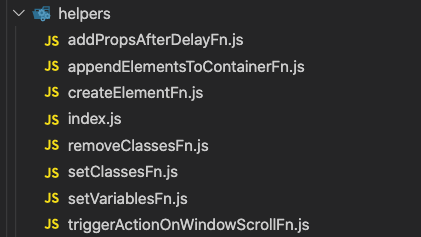

# Portfolio website


The website presents information about me and shows created projects

<br/>
<br/>

## Table of Contents

1. General info
2. Technologies
3. Setup
4. Features
5. Inspirations
   <br/>
   <br/>

## 1. General info

The aim of the project is to provide information about my person, my skills and to show the applications that I have created with a detailed description
<br/>
<br/>

## 2. Technologies

The following technologies were used in the project:

- HTML
- CSS (small own framework)
- Javascript (OOP)
  <br/>
  <br/>

## 3. Setup

You don't need any commands to run this project
<br/>
<br/>

## 4. Features

Most of the project is built in oop javascript for a very in-depth understanding of the language. The list of the most interesting solutions used in the stakes is presented below:

&nbsp; &nbsp; &nbsp; &nbsp; 4.1. Helpers <br/>
&nbsp; &nbsp; &nbsp; &nbsp; 4.2. Clean way to add js objects <br/>
&nbsp; &nbsp; &nbsp; &nbsp; 4.3. Own way of creating project descriptions <br/>
&nbsp; &nbsp; &nbsp; &nbsp; 4.4. CSS classes and another properties in variables <br/>
&nbsp; &nbsp; &nbsp; &nbsp; 4.5. Dynamic Form with validation, notifications and loader <br/>
&nbsp; &nbsp; &nbsp; &nbsp; 4.6. Customize theme <br/>
&nbsp; &nbsp; &nbsp; &nbsp; 4.7. Own small framework

<br/>
<br/>

### 4.1. Helpers

Due to the fact that most of the operations in the code are repeated, functions have been separated in the helpers folder, which are reusable throughout the project. Here are some examples of cool features:
<br/>
<br/>

<br/>
<br/>

The function that plays the biggest role in the project is createElementFn.js, which is responsible for creating html elements with all properties in js classes.
Below is the code example:
<br/>

```
export default ({ element, ...rest }) => {
  const createdElement = document.createElement(element)

  if (Object.keys(rest).length) {
    for (const propEl in rest) {
      if (propEl === 'listeners') {
        rest[propEl].map((listener) => {
          const { event, cb } = listener
          createdElement.addEventListener(event, (e) => {
            cb(e)
          })
        })
      } else if (propEl === 'attributes') {
        rest[propEl].map((attribute) => {
          createdElement.setAttribute(`${attribute.type}`, `${attribute.name}`)
        })
      } else if (propEl === 'classes') {
        createdElement.classList.add(...rest[propEl])
      } else if (propEl === 'styles') {
        rest[propEl].map((styleObj) => {
          createdElement.style[styleObj.name] = styleObj.value
        })
      } else createdElement[propEl] = rest[propEl]
    }
  }

  return createdElement
}
```

<br/>
Another interesting helper is triggerActionOnWondowScrollFn, which is responsible for calling the function in the right place when scrolling the window.
The main use for this feature is to support the appearance of posts section and global left buttons.

<br/>
<br/>

Below is the code for this solution:

```
export default ({
  onWhatElement,
  cbWhenTrue = () => {},
  cbWhenFalse = () => {},
  modifier = 1,
}) => {
  if (!onWhatElement) return

  let element = onWhatElement

  if (typeof onWhatElement === 'string') {
    element = document.querySelector(onWhatElement)
  }

  window.addEventListener('scroll', () => {
    if (
      window.innerHeight + window.pageYOffset * modifier >
      element.offsetTop
    ) {
      cbWhenTrue(element)
    } else {
      cbWhenFalse(element)
    }
  })
}
```

  <br/>
  <br/>

### 4.2. Clean way to add js objects

Another interesting solution in the project is the ability to add individual functionalities by adding objects to the appropriate pages.

Below, we can see that, for example, the home page includes support for the form, sound, theme and posts:

<br/>

scripts/sites/main.js

```
import posts from '/data/sets/posts.js'
import themes from '/data/global/themes.js'
import { Sound, Form, Posts, Theme, Particles } from '../objects/index.js'
import { idReferences } from '/data/global/names.js'

new Sound(idReferences.global.leftContainer, idReferences.posts.trigger)
new Form(idReferences.global.leftContainer, idReferences.posts.trigger)
new Theme(idReferences.theme.main, themes, Particles)
new Posts(
  idReferences.posts.main,
  idReferences.posts.trigger,
  idReferences.posts.wrapper,
  posts
)
```

<br/>

scripts/sites/fluentBlog.js

```
import themes from '/data/global/themes.js'
import data from '/data/sets/projects/fluentBlog.js'
import {
  DataArrange,
  Theme,
  Particles,
  Form,
  BackBtn,
  Sound,
} from '../objects/index.js'
import { idReferences } from '/data/global/names.js'

new Theme(idReferences.theme.main, themes, Particles)
new DataArrange(idReferences.project.description, data)
new BackBtn(idReferences.global.leftContainer)
new Sound(idReferences.global.leftContainer, idReferences.posts.trigger)
new Form(idReferences.global.leftContainer)
```

<br/>

and below is the corresponding scripts to handle above js files:

```
<script type="module" type="text/javascript" src="./scripts/sites/main.js"></script>
```

```
<script type="module" type="text/javascript" src="./scripts/sites/fluentBlog.js"></script>
```

<br/>
<br/>

### 4.3. Own way of creating project descriptions

Due to the large amount of content related to the description of individual projects, another solution was created that allows writing texts in a more comfortable way. The DataArrange.js object has been developed to convert the written text into html code with appropriate styles.

<br/>

Below is an example of this solution:

```
import {
  createElementFn,
  appendElementsToContainerFn,
} from '../helpers/index.js'
import { classNames } from '../../data/global/names.js'

class DataArrange {
  constructor(container, data) {
    const containerSent = document.querySelector(container)
    const dataArrangeElements = this.createDataArrangeElements(data)
    appendElementsToContainerFn(dataArrangeElements, containerSent)
  }

  createDataArrangeElements(elements) {
    const dataArrangeElements = []

    elements.map((element) => {
      if (element.headline) {
        const headline = createElementFn({
          element: 'h2',
          classes: [
            classNames.utilities.text.center,
            classNames.utilities.margin.t10,
          ],
          textContent: element.headline,
        })
        dataArrangeElements.push(headline)
      } else if (element.title) {
        const title = createElementFn({
          element: 'h3',
          textContent: element.title,
          classes: [
            classNames.utilities.margin.t40,
            classNames.utilities.margin.b40,
          ],
        })

        dataArrangeElements.push(title)
      } else if (element.image) {
        const image = createElementFn({
          element: 'img',
          classes: [
            classNames.utilities.border.rounded,
            classNames.utilities.width.full,
            classNames.utilities.margin.y20,
          ],
          src: element.image,
        })

        dataArrangeElements.push(image)
      } else if (element.text) {
        element.text.map((el) => {
          const text = createElementFn({
            element: 'p',
            classes: [
              classNames.utilities.margin.y10,
              classNames.utilities.text.justify,
              classNames.utilities.text.smLeft,
              classNames.utilities.text.lh25,
            ],
            textContent: el,
          })

          dataArrangeElements.push(text)
        })
      } else if (element.links) {
        element.links.map((linkEl) => {
          const link = createElementFn({
            element: 'a',
            target: '_blank',
            classes: [
              classNames.utilities.text.justify,
              classNames.utilities.text.smLeft,
            ],
            href: linkEl.path,
            textContent: linkEl.linkText,
          })
          const text = createElementFn({
            element: 'p',
            classes: [classNames.utilities.margin.y10],
            textContent: linkEl.label,
          })

          text.appendChild(link)
          dataArrangeElements.push(text)
        })
      }
    })
    return dataArrangeElements
  }
}

export default DataArrange
```

<br/>

Below is an example of a text describing one of my applications that has been prepared for processing:

```
export default [
  { headline: 'Short app description' },
  { title: '1. Introduction' },
  { image: '/images/projects/FluentBlog/viewSites.gif' },
  {
    text: [
      'The application was built using the Next.js technology due to the speed and ease of development, efficiency and the ability to render the code on the server side, which contributes to better SEO.',
      'Below is quickly view of app:',
    ],
  },
  { image: '/images/projects/FluentBlog/styles.gif' },
  { title: '2. Application content' },
  {
    text: [
      'The project includes 3 subpages such as: Blog, About and Projects nad one which generate article from .md file',
      'You can see it in the example below',
    ],
  },
  { image: '/images/projects/FluentBlog/browseArticle.gif' },
  {
    text: [
      'Below is a high abstraction of code that is responsible for dynamic article creation using the getStaticPaths and getStaticProps methods characteristic of Next.js',
      '(all logic under the visible layer is available on my repository, the link to which will be at the bottom of page)',
    ],
  },
  { image: '/images/projects/FluentBlog/articleCode.gif' },
  {
    text: ['Below is article example write in markdown extension'],
  },
  { image: '/images/projects/FluentBlog/article.gif' },
  { title: '3. Loader component' },
  {
    text: [
      'Due to the fact that not everyone can access high-speed internet, the Loader component was created to inform the user that his article is loading. Thanks to this, the user will immediately receive feedback on what is happening on the website.',
    ],
  },
  { image: '/images/projects/FluentBlog/loading.gif' },
  { text: ['Below is a solution in the code.'] },
  { image: '/images/projects/FluentBlog/loaderCode.gif' },
  { title: '4. Mobile version' },
  { image: '/images/projects/FluentBlog/mobile.gif' },
  {
    text: [
      'The use of the application with intuitively arranged website components was made as pleasant as possible. The mobile version has a responsive layout and hamburger menu to fast navigate.',
    ],
  },
  {
    title: '4. Check the app!',
  },
  {
    links: [
      {
        label: 'Check entire website ',
        linkText: 'here!',
        path: 'https://fluent-blog.vercel.app/',
      },
      {
        label: 'Check github repository ',
        linkText: 'here!',
        path: 'https://github.com/damian-lis/Fluent-Blog',
      },
    ],
  },
]
```

<br/>

The final effect of how the user sees on the website is presented below:


<br/>
<br/>

### 4.4. CSS classes and another properties in variables

Due to the frequent use of class names and other properties in JavaScript, they have been separated into variables to avoid errors and typos.

Below is an short example of the class names solution:

```
export const classNames = {
  curtain: {
    container: 'curtain-container',
    active: 'curtain-active',
  },
  form: {
    card: 'form-card',
    titleContainer: 'form-title-container',
    title: 'form-title',
    outerContainer: 'form-outer-container',
    innerContainer: 'form-inner-container',
    main: 'form',
    field: 'form-field',
    fieldMessage: 'form-field-message',
    btnDeleteContainer: 'form-btn-delete-container',
    btnDelete: 'form-btn-delete',
    spinnerContainer: 'form-spinner-container',
    spinner: 'form-spinner',
    fieldSubmitNotification: 'form-field-submit-notification',
    fieldInputNotification: 'form-field-input-notification',
  },
}
```

<br/>
<br/>

### 4.5. Dynamic Form with validation, notifications and loader

A form with appropriate validation was created in the project, which is dynamically generated by pressing the button on the left side of the page.

Below is an example of the validation a user can see on the site


<br/>

The entire form is handled by a backend application called Emails handler. Its description is on my github.

Due to the waiting time for the response from the server regarding the sent e-mail, a loader has been created, which informs the user that something is being processed.
If the whole waiting process is longer, the user will be shown various notifications related to the delay.
An examples of such a situation is presented below:


<br/>

The entire implementation of the form's code is available in the Form.js file. It was not posted here due to too much code

<br/>
<br/>

### 4.6. Customize theme

On the website, the user can customize the theme depending on his preferences.

To create a unique page style, the Particles.js object has been added, which is responsible for generating particles, which also change with the adaptation of the theme and has the ability to resize.

Below is an visual example of theme customization:


<br/>

All theme settings are stored in the themes.js file, an example of which is given below

```
export default {
  blue: {
    mainColor: '#15202b',
    secondaryColor: '#192734',

    borderColor: 'rgb(57, 119, 179)',

    strokeColor: '57, 119, 179',
    ctxFillStyle: 'rgb(57, 119, 179)',

    mainText: '#fff',
    secondaryText: '#eeeeee',

    themeDotBorder: '#fff',

    previewBg: 'rgb(25, 39, 52, 0.8)',
    previewShadow: '#111921',

    buttonColor: '#214569',
  },

  green: {
    mainColor: '#606b56',
    secondaryColor: '#515a48',

    borderColor: 'rgb(169, 209, 132)',

    strokeColor: '169, 209, 132',
    ctxFillStyle: 'rgb(169, 209, 132)',

    mainText: '#fff',
    secondaryText: '#eeeeee',

    themeDotBorder: '#fff',

    previewBg: 'rgb(81, 90, 72, 0.8)',
    previewShadow: '#2a2f25',

    buttonColor: '#6b8059',
  },
  purple: {
    mainColor: '#46344e',
    secondaryColor: '#382a3f',

    borderColor: 'rgb(154, 0, 154)',

    strokeColor: '154, 0, 154',
    ctxFillStyle: 'rgb(154, 0, 154)',

    mainText: '#fff',
    secondaryText: '#eeeeee',

    themeDotBorder: '#fff',

    previewBg: 'rgb(29, 21, 32, 0.8)',
    previewShadow: '#2b202f',

    buttonColor: '#5c3669',
  },
}
```

<br/>
<br/>

### 4.7. Own small framework

A small proprietary css framework was created that combines the world of React components, Bootstrap and TailwindCSS. This solution was created out of the desire to get to know CSS technology very well. Below are some examples of this solution:


<br/>

An example of a margin.css file modeled on TailwindCSS:

```
/* Global */
.m-0 {
  margin: 0;
}

.m-10 {
  margin: 10px;
}

.m-20 {
  margin: 20px;
}

.m-30 {
  margin: 30px;
}

.m-40 {
  margin: 40px;
}

.m-50 {
  margin: 50px;
}
```

<br/>

An example of use in html file:

```
<div id="greetings" class="col-60 content-center-xy">
  <div class="card px-20 sm-mb-30 sm-p-10 slideInFromRight">
    <h1 class="text-center sm-my-10 showObject">Hi, I am Damian Lis!</h1>
  </div>
</div>
```

<br/>
<br/>

## 5. Inspirations

The design was inspired by Dennis Ivy's project [here](https://github.com/divanov11/portfolio-website). Most of the elements in the project have been changed, the entire javascript has been rewritten in the oop convention and new solutions have been introduced, which have been partially described above.
